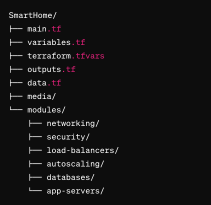

# 🏠 SmartHome 
In this project, I designed and implemented a microservices architecture, utilizing Terraform to provision and manage the AWS resources. 
Each component of the architecture is modularized using Terraform modules, ensuring reusability, maintainability and scalability.

SmartHome, was developed as part of my Cloud Engineering bootcamp at Northcoders. The goal of this project was to create a scalable and resilient microservices network within an AWS infrastructure, using Infrastructure as Code (IaC) with Terraform. 


## Structure: Modules
This section provides an overview of the modules included in this Terraform configuration and their functionality.

<div align="center">
  
</div>

### **Networking**
Creates a VPC (Virtual Private Cloud) that spans across three availability zones (each containing Public and Private subnets, providing segregation of resources and enhancing security).

The VPC is configured to accept and route internet traffic through the IGW (Internet Gateway), and deploys a NAT gateway that facilitates secure communication between public and private subnets as well as enables bidirectional traffic routing within the VPC and to the internet.


### **Security**
Sets up a bastion host architecture for secure access to AWS EC2 instances.

This module consists of three security groups:

- **Bastion Host Security Group (bastion_sg)**:
Allows inbound SSH (port 22) traffic from specified IP addresses and permits outbound HTTP (port 80) and HTTPS (port 443) traffic to the internet.

- **Public Instances Security Group (public_sg)**:
Allows inbound SSH, HTTP, and HTTPS traffic from the bastion host's security group. It is designed for EC2 instances accessible from the internet.

- **Private Instances Security Group (private_sg)**:
Allows inbound SSH, HTTP, and HTTPS traffic from the bastion host's security group. It is intended for EC2 instances not directly accessible from the internet.

### **Databases**
Creates two DynamoDB tables, specifically designed for managing data related to lighting and heating systems.


The tables are configured with the "PAY_PER_REQUEST" billing mode, each table uses the "id" attribute as the hash key and the "id" attribute is configured as a numeric attribute ("N") for optimal storage and query performance.


### **App-servers**
Sets up five EC2 servers for each service, including a bastion host. They all have their specific and adequate security groups and subnets ids depending on their privacy settings.


### **Load Balancers**
Orchestrates load balancing and routing for public and private services within the SmartHome.

For the public services, it creates an Application Load Balancer (ALB) to distribute incoming traffic across multiple instances of the application.
Each public service (heating, lighting, and status) has its own target group within the ALB, ensuring proper routing of requests. 

For the private service, like authentication (auth), there's a separate ALB created. This one works internally within the app to handle communication between different parts of the system, keeping things running smoothly behind the scenes.
 
### **Autoscaling**
Sets up a launch template for the instances in the Smart Home application. 
It specifies the instance type, operating system image, security group, SSH key, and initial setup script. 
It also creates an autoscaling group that utilizes this launch template.

## Usage

#### **Getting Started**
***AWS Account and Credentials***
- Create an [AWS Account](https://aws.amazon.com/)
- Install [AWS CLI](https://docs.aws.amazon.com/cli/latest/userguide/getting-started-install.html)
- Create an [AWS IAM User](https://docs.aws.amazon.com/IAM/latest/UserGuide/getting-started_create-admin-group.html) with Admin or Power User Permissions
  - this user will only be used locally
- [Configure the AWS CLI](https://docs.aws.amazon.com/cli/latest/userguide/cli-chap-configure.html) with the IAM User from the previous step.
  - Terraform will read your credentials via the AWS CLI 
  - [Other Authentication Methods with AWS and Terraform](https://registry.terraform.io/providers/hashicorp/aws/latest/docs#authentication)

***Terraform***
- Install [HashiCorp Terraform](https://www.terraform.io/downloads)
- Install [Node.js](https://nodejs.org/en/)

Before proceeding, ensure that you have authenticated your AWS account via the AWS CLI using your access keys.

#### **Usage: Create an key-pair**
In order to ssh into the bastion (and then into the app servers/instances), remember to create a key pair in the aws console with the name of **smarthome-apps** and apply the ssh command in the same directory that your .pem key file is in. 

<div align="center">
  
</div>

#### **Usage: Create an IAM USER**
You need to create an **IAM user** for these future services (lighting, heating) to interact with the databases so that they can authenticate the requests.

Use the IAM service on the AWS console to create a user that;

- Has policies which allow full access to DynamoDB
- Once created, give this user CLI access and save your keys somewhere as you will need to inject them later on into some of the services. (Check the .env.local files)


#### **Usage: Customize the values of the terraform.tfvars file**
To use these modules in your infrastructure, redirect yourself to the **terraform.tfvars** file located in the root directory and customize the values according to your specific requirements. 

Here's an example:

```hcl
# VPC 
vpc_name             = "smart-home-microservices-vpc"
vpc_cidr_block       = "10.0.0.0/20"
enable_dns_hostnames = true

public_subnets = [{
  cidr_range              = "10.0.0.0/24"
  availability_zone       = "eu-west-2a"
  map_public_ip_on_launch = true
  }, {
  cidr_range              = "10.0.1.0/24"
  availability_zone       = "eu-west-2b"
  map_public_ip_on_launch = true
  }, {
  cidr_range              = "10.0.2.0/24"
  availability_zone       = "eu-west-2c"
  map_public_ip_on_launch = true
}]

private_subnets = [{
  cidr_range        = "10.0.10.0/24"
  availability_zone = "eu-west-2a"
  }, {
  cidr_range        = "10.0.11.0/24"
  availability_zone = "eu-west-2b"
  }, {
  cidr_range        = "10.0.12.0/24"
  availability_zone = "eu-west-2c"
}]

# Security
allowed_ips = ["X.X.X.X/32"] # Replace it with your IP address or IP ranges allowed for SSH access

# DynamoDB tables (databases)
table_names   = ["lighting", "heating"]
hash_key      = "id"
hash_key_type = "N"

# Autoscaling
instance_type = "t2.micro"

desired_capacity = 3
max_size = 3
min_size = 1


```

After customizing the values, you can run Terraform commands: 
1. **terraform init** to initialize the project
2. **terraform plan** to generate an execution plan
3. And **terraform apply** to apply the changes to your infrastructure


